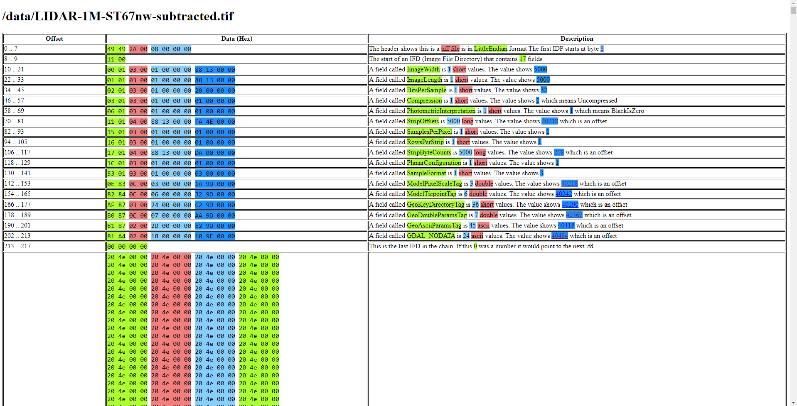

# Tiff Hax



Tiff Hax is a tool to help visualise the internals of a Tiff file.

When you run the tool it will open the system web browser showing an annotated dump of the tiff
with colour coding and hyperlinks between offsets.

Download the latest build from the releases section. Put it somewhere in your path. Then call it
with something like the following:

```bash
tiffhax <path to a tiff file>
```

### Building

```bash
go build .
```